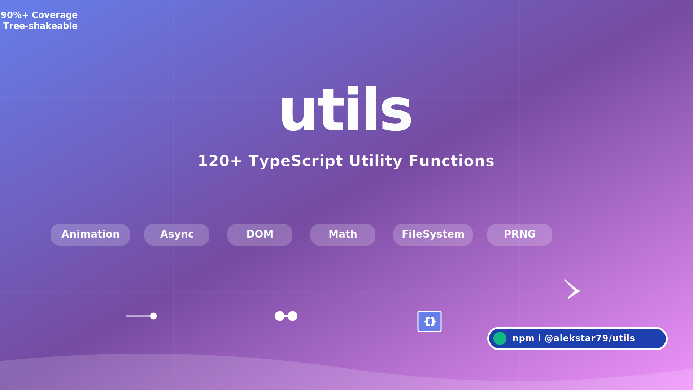

# Utility Library

[](https://www.npmjs.com/package/utils)
[](https://github.com/alekstar79/utils/actions)
[](https://www.typescriptlang.org)
[](https://nodejs.org)
[]()
[](LICENSE)

A comprehensive utility library for TypeScript/JavaScript, providing over 120 tools for working with arrays, asynchronous operations, DOM, animation, caching, and random number generation.
All modules are strictly typed and ready for use in modern projects.



## 📦 Installation

```bash
# Using npm
npm install @alekstar79/utility

# Using yarn
yarn add @alekstar79/utility

# Using pnpm
pnpm add @alekstar79/utility
```

## 🚀 Quick Start

```typescript
// Import individual modules
import { chunk, debounce, CancelablePromise } from '@alekstar79/utility'

// Splitting array into chunks
const numbers = [1, 2, 3, 4, 5, 6, 7, 8, 9]
const chunks = chunk(numbers, 3) // [[1,2,3], [4,5,6], [7,8,9]]

// Using debounce for event handling
const searchHandler = debounce((query: string) => {
console.log('Searching for:', query)
}, 300)

// Cancelable promise
const fetchData = new CancelablePromise(async (signal) => {
const response = await fetch('/api/data', { signal })
return response.json()
})

// Cancel after 5 seconds
fetchData.cancelAfter(5000)
```

## 📚 Table of Contents

<!-- TOC -->
* [Utility Library](#utility-library)
  * [📦 Installation](#-installation)
  * [🚀 Quick Start](#-quick-start)
  * [📚 Table of Contents](#-table-of-contents)
  * [API Reference](#api-reference)
    * [Common Utilities](#common-utilities)
    * [Asynchronous Operations](#asynchronous-operations)
    * [Caching](#caching)
    * [String Operations](#string-operations)
    * [Data Manipulation](#data-manipulation)
    * [DOM Utilities](#dom-utilities)
    * [Value Generation](#value-generation)
    * [Functional Programming](#functional-programming)
    * [Animation System](#animation-system)
    * [DOM Utilities](#dom-utilities-1)
    * [Observers](#observers)
    * [PRNG System](#prng-system)
  * [Common Utilities](#common-utilities-1)
    * [Array Operations](#array-operations)
    * [Asynchronous Operations](#asynchronous-operations-1)
    * [Caching](#caching-1)
    * [String Operations](#string-operations-1)
    * [Data Manipulation](#data-manipulation-1)
    * [DOM Utilities](#dom-utilities-2)
    * [Functional Programming](#functional-programming-1)
  * [Animation System](#animation-system-1)
  * [DOM Utilities](#dom-utilities-3)
  * [Observers](#observers-1)
  * [Random Number Generation](#random-number-generation)
    * [PRNG System (Pseudo-Random Number Generators)](#prng-system-pseudo-random-number-generators)
    * [PRNG Algorithms](#prng-algorithms)
  * [Browser Compatibility](#browser-compatibility)
    * [✅ Full Support](#-full-support)
    * [⚠️ Partial Support](#-partial-support)
  * [Web API Dependencies](#web-api-dependencies)
  * [Tree-shaking Support](#tree-shaking-support)
    * [License MIT © alekstar79](#license-mit--alekstar79)
<!-- TOC -->

## API Reference

### Common Utilities

| Module         | Main Exports                                | Description                        |
|----------------|---------------------------------------------|------------------------------------|
| `array.ts`     | `ExtendedArray`, `extendedArray`            | Array with circular navigation     |
| `binary.ts`    | *extends Array.prototype*                   | Binary search, insertion, deletion |
| `chunk.ts`     | `chunk`, `chunkStats`, `createChunker`      | Array splitting into chunks        |
| `shuffle.ts`   | `shuffle`                                   | Array shuffling                    |
| `sortArray.ts` | `sortArray`, `sortAll`, `presets`           | Advanced sorting                   |
| `range.ts`     | `range`, `rangeStats`, `rangeSum`, `ranges` | Number range generation            |
| `shift.ts`     | `shift`                                     | Circular array shifting            |

### Asynchronous Operations

| Module                 | Main Exports        | Description           |
|------------------------|---------------------|-----------------------|
| `asyncArray.ts`        | `AsyncArray`        | Async arrays          |
| `asyncIter.ts`         | `asyncIter`         | Async iterators       |
| `cancelablePromise.ts` | `CancelablePromise` | Cancelable promises   |
| `worker.ts`            | `workerInit`        | Web worker management |

### Caching

| Module             | Main Exports                       | Description              |
|--------------------|------------------------------------|--------------------------|
| `cached.ts`        | `cached`, `createCachedFunction`   | Function memoization     |
| `cached-worker.ts` | `cachedWorker`                     | Cached web workers       |
| `lruCache.ts`      | `LRUCache`                         | LRU cache with TTL       |
| `watch.ts`         | `Watcher`, `rafWatch`, `idleWatch` | Value change observation |

### String Operations

| Module           | Main Exports         | Description                |
|------------------|----------------------|----------------------------|
| `truncate.ts`    | `truncate`           | String truncation          |
| `trim.ts`        | `trim`               | Extended trimming          |
| `mask.ts`        | `mask`, `createMask` | Data masking               |
| `declination.ts` | `declination`        | Word declension by numbers |

### Data Manipulation

| Module            | Main Exports                | Description                       |
|-------------------|-----------------------------|-----------------------------------|
| `deepMerge.ts`    | `deepMerge`                 | Deep object merging               |
| `pick.ts`         | `pick`                      | Object property selection         |
| `equal.ts`        | `deepEqual`, `shallowEqual` | Deep comparison                   |
| `formToObj.ts`    | `formToObj`                 | Form to object conversion         |
| `queryToObj.ts`   | `queryToObj`                | Query string parsing              |
| `objToQuery.ts`   | `objToQuery`                | Object to query string conversion |
| `parseDataUrl.ts` | `parseDataUrl`              | Data URL operations               |

### DOM Utilities

| Module             | Main Exports                  | Description                 |
|--------------------|-------------------------------|-----------------------------|
| `clipboard.ts`     | `Clipboard`, `ClipboardUtils` | Clipboard operations        |
| `cookie.ts`        | `cookie`, `cookieStringify`   | Cookie management           |
| `objToCookie.ts`   | `objectToCookie`              | Object to cookie conversion |
| `fullscreen.ts`    | `Fullscreen`                  | Fullscreen mode management  |
| `getStyles.ts`     | `getStyles`                   | Element style retrieval     |
| `pixelRatio.ts`    | `getPixelRatio`               | Determining pixel ratio     |
| `textMeasuring.ts` | `useTextMeasuring`            | Text measuring tracker      |

### Value Generation

| Module               | Main Exports                               | Description                             |
|----------------------|--------------------------------------------|-----------------------------------------|
| `random.ts`          | `random`                                   | Random values                           |
| `randomColor.ts`     | `randomColor`, `randomColorPalette`        | Random colors                           |
| `randomStr.ts`       | `randomString`, `randomStrings`, `presets` | Random strings                          |
| `uuid.ts`            | `uuid`                                     | UUID generation                         |
| `hash.ts`            | `hash`                                     | Hashing                                 |
| `secureRandomInt.ts` | `secureRandomInt`                          | Cryptographically secure random numbers |

### Functional Programming

| Module     | Main Exports                 | Description          |
|------------|------------------------------|----------------------|
| `curry.ts` | `curry`                      | Function currying    |
| `pipe.ts`  | `pipe`, `createPipe`         | Function composition |
| `each.ts`  | `each`                       | Collection iteration |
| `map.ts`   | `ExtendedMap`, `extendedMap` | Functional mapping   |

### Animation System

| Module             | Main Exports         | Description          |
|--------------------|----------------------|----------------------|
| `Animator.ts`      | `Animator`           | Basic animator class |
| `AnimatorChain.ts` | `AnimatorChain`      | Animation chains     |
| `Timing.ts`        | `Timing`             | Timing functions     |
| `easing.ts`        | *8 easing functions* | Easing functions     |

### DOM Utilities

| Module         | Main Exports                | Description                 |
|----------------|-----------------------------|-----------------------------|
| `dom-utils.ts` | *19 functions*              | Comprehensive DOM utilities |
| `popup.ts`     | `popup`, `getScreenMetrics` | Popup management            |

### Observers

| Module                    | Main Exports                                                                                      | Description           |
|---------------------------|---------------------------------------------------------------------------------------------------|-----------------------|
| `baseObserver.ts`         | `BaseObserver`                                                                                    | Abstract class        |
| `intersectionObserver.ts` | `IntersectionObserverWrapper`, `createIntersectionObserver`, `createIntersectionObserverMultiple` | Intersection observer |
| `mutationObserver.ts`     | `MutationObserverWrapper`, `createMutationObserver`, `createMutationObserverMultiple`             | Mutation observer     |
| `resizeObserver.ts`       | `ResizeObserverWrapper`, `createResizeObserver`, `createResizeObserverMultiple`                   | Resize observer       |

### PRNG System

| Module                  | Main Exports                             | Description                   |
|-------------------------|------------------------------------------|-------------------------------|
| `jsf32.ts`              | `jsf32Generator`                         | Jenkins Small Fast 32-bit     |
| `lcg.ts`                | `lcgGenerator`                           | Linear Congruential Generator |
| `mulberry32.ts`         | `mulberry32Generator`                    | Mulberry32 algorithm          |
| `sfc32.ts`              | `sfc32Generator`                         | Simple Fast Counter 32-bit    |
| `xorshift128.ts`        | `xorshift128Generator`                   | Xorshift128 algorithm         |
| `useSeededGenerator.ts` | `useSeededGenerator`                     | Seeded generator management   |
| `utils.ts`              | `initializeBuffer`, `foldBuffer`, `rotl` | PRNG utilities                |


## Common Utilities
[Up to table of content](#-table-of-contents)

### Array Operations

- `array.ts` - Extended Array with Circular Navigation 
[Source Code](src/common/array.ts)

```typescript
import { ExtendedArray, extendedArray } from '@alekstar79/utility'

// Creating extended array
const colors = new ExtendedArray('red', 'green', 'blue', 'yellow')
// or from existing array
const numbers = extendedArray([1, 2, 3, 4, 5])

// Circular navigation
colors.prev('red')    // 'yellow' (last element)
colors.next('yellow') // 'red' (first element)
colors.next('green')  // 'blue'

// Methods
const current = 'blue'
const previous = colors.prev(current) // 'green'
const next = colors.next(current)     // 'yellow'
```

- `binary.ts` - Binary Search, Insertion and Deletion 
[Source Code](src/common/binary.ts)

```typescript
// Methods are added to Array prototype
import '@alekstar79/utility/common/binary'

const sortedArray = [1, 3, 5, 7, 9, 11, 13]

// Binary search
const index = sortedArray.binarySearch(7) // 3
const notFound = sortedArray.binarySearch(6) // -5 (bitwise NOT of 4)

// Insertion while maintaining order
sortedArray.binaryInsert(8) // [1, 3, 5, 7, 8, 9, 11, 13]
sortedArray.binaryInsert(5, false) // Duplicates not allowed

// Deletion
const deletedIndex = sortedArray.binaryDelete(9) // 5

// Custom comparator
interface User {
  id: number;
  name: string;
}

const users: User[] = [
  { id: 1, name: 'Alice' },
  { id: 3, name: 'Bob' },
  { id: 5, name: 'Charlie' }
]

const userComparator = (a: User, b: User) => a.id - b.id
users.binarySearch({ id: 3, name: '' }, userComparator) // 1
```

- `chunk.ts` - Splitting Arrays into Chunks 
[Source Code](src/common/chunk.ts)

```typescript
import { chunk, chunkStats, createChunker } from '@alekstar79/utility'

const numbers = [1, 2, 3, 4, 5, 6, 7, 8, 9]

// Basic splitting
const chunks = chunk(numbers, 3);
// [[1,2,3], [4,5,6], [7,8,9]]

// With padding
const padded = chunk(numbers, {
  size: 4,
  fill: 'pad',
  padValue: 0
})
// [[1,2,3,4], [5,6,7,8], [9,0,0,0]]

// With grouping
const users = [
  { id: 1, category: 'A', score: 10 },
  { id: 2, category: 'B', score: 20 },
  { id: 3, category: 'A', score: 30 },
  { id: 4, category: 'B', score: 40 },
  { id: 5, category: 'A', score: 50 }
]

const grouped = chunk(users, {
  size: 2,
  groupBy: 'category'
})
// Group A: [[{id:1}, {id:3}], [{id:5}]]
// Group B: [[{id:2}, {id:4}]]

// Reverse splitting
const backward = chunk(numbers, {
  size: 4,
  direction: 'backward'
})
// [[5,6,7,8], [1,2,3,4]]

// Statistics
const stats = chunkStats(chunks)
console.log({
  totalChunks: stats.totalChunks,     // 3
  totalItems: stats.totalItems,       // 9
  fullChunks: stats.fullChunks,       // 3
  partialChunks: stats.partialChunks, // 0
  avgChunkSize: stats.avgChunkSize    // 3
})

// Creating reusable chunker
const chunkBy3 = createChunker({ size: 3 })
const result = chunkBy3([10, 20, 30, 40, 50]) // [[10,20,30], [40,50]]
```

- `shuffle.ts` - Array Shuffling 
[Source Code](src/common/shuffle.ts)

```typescript
import { shuffle } from '@alekstar79/utility'

const array = [1, 2, 3, 4, 5, 6, 7, 8, 9]
const shuffled = shuffle(array) // [3, 7, 1, 9, 4, 2, 8, 5, 6] (random)

// Using custom random number generator
const customShuffle = shuffle(array, () => Math.random())
```

- `sortArray.ts` - Advanced Sorting Methods 
[Source Code](src/common/sortArray.ts)

```typescript
import { sortArray, sortAll, presets } from '@alekstar79/utility'

const users = [
{ name: 'Alice', age: 30, score: 85 },
{ name: 'Bob', age: 25, score: 92 },
{ name: 'Charlie', age: 35, score: 85 },
{ name: 'Diana', age: 25, score: 88 }
]

// Sorting by field
const byAge = sortArray(users, { key: (item: any) => item.age })
// First Bob (25), Diana (25), Alice (30), Charlie (35)

// Sorting multiple arrays
const arrays = [[3, 1], [6, 4, 2]]
const byAgeAndScore = sortAll(arrays)
// [[1, 3], [2, 4, 6]]

// Presets
presets.numbers([3, 1, 2]) // [1, 2, 3]
presets.strings(['c', 'a', 'b']) // ['a', 'b', 'c']
```

- `range.ts` - Number Range Generation 
[Source Code](src/common/range.ts)

```typescript
import { range, ranges, rangeStats, rangeSum } from '@alekstar79/utility'

// Basic usage
range(5) // [0, 1, 2, 3, 4]
range(1, 6) // [1, 2, 3, 4, 5]
range(0, 10, 2) // [0, 2, 4, 6, 8]

// Negative step
range(5, 0, -1) // [5, 4, 3, 2, 1]

// Floating point
range(0, 1, 0.2) // [0, 0.2, 0.4, 0.6, 0.8]
```

- `shift.ts` - Circular Array Shifting 
[Source Code](src/common/shift.ts)

```typescript
import { shift } from '@alekstar79/utility'

shift([1, 2, 3, 4, 5],  1, 2)  // [4, 5, 1, 2, 3] - right shift
shift([1, 2, 3, 4, 5], -1, 2)  // [3, 4, 5, 1, 2] - left shift
```

### Asynchronous Operations

- `asyncArray.ts` - Async Array Methods 
[Source Code](src/common/asyncArray.ts)

```typescript
import { AsyncArray } from '@alekstar79/utility'

const array = new AsyncArray(1, 2, 3)
const iterator = array[Symbol.asyncIterator]()

const result1 = await iterator.next()
console.log(result1.value) // 1
console.log(result1.done)  // false

const result2 = await iterator.next()
console.log(result2.value) // 2
console.log(result2.done)  // false

const result3 = await iterator.next()
console.log(result3.value) // 3
console.log(result3.done)  // false

const result4 = await iterator.next()
console.log(result4.value) // undefined
console.log(result4.done)  // true
```

```typescript
import { AsyncArray } from '@alekstar79/utility'

// Creating async array
const asyncItems = AsyncArray.of(1, 2, 3, 4, 5)

// Async iteration
;(async () => {
  for await (const item of asyncItems) {
    console.log(item); // 1, 2, 3, 4, 5 (with delays between elements)
  }
})()

// Using as regular array
asyncItems.push(6)
asyncItems.length // 6
asyncItems.map(x => x * 2) // [2, 4, 6, 8, 10, 12]
```

- `asyncIter.ts` - Async Iterators for Promises
[Source Code](src/common/asyncIter.ts)

```typescript
import { asyncIter } from '@alekstar79/utility'

// Converting promise array to async iterable
const promises = [1, 2, 3, 4, 5].map(n => Promise.resolve(n * 2))

;(async () => {
  for await (const value of asyncIter(promises)) {
    console.log(value) // 2, 4, 6, 8, 10
  }
})()

// Usage with real API requests
const apiRequests = [
  fetch('/api/users/1').then(r => r.json()),
  fetch('/api/users/2').then(r => r.json()),
  fetch('/api/users/3').then(r => r.json())
]

for await (const user of asyncIter(apiRequests)) {
  console.log('User:', user)
}
```

- `cancelablePromise.ts` - Cancelable Promises
[Source Code](src/common/cancelablePromise.ts)

```typescript
import { CancelablePromise } from '@alekstar79/utility'

// 1. Basic usage with timeout
const task = new CancelablePromise(async (signal) => {
  await fetch('/api/data', { signal })
  return 'Data loaded'
}, { timeout: 5000 })

task.onTimeout(() => console.log('Task timed out'))
task.cancelAfter(3000)

// 2. Wrapper for existing promise
const existingPromise = fetch('/api/users').then(r => r.json())
const cancelableFetch = new CancelablePromise(existingPromise)
cancelableFetch.cancelAfter(2000)

// 3. Promise chain with cancellation
fetch('/api')
  .then(res => res.json())
  .then(data => new CancelablePromise(resolve => setTimeout(() => resolve(data), 1000)))
  .cancelAfter(500)
  .catch(err => {
    if (err.code === 'CANCELLED') {
      console.log('Operation cancelled');
    }
  })

// 4. Race with cancellation of losers
const [winner] = await CancelablePromise.race([
  slowApiCall(),
  fastApiCall()
])

// 5. Integration with AbortController
const controller = new AbortController()
const taskWithExternalSignal = new CancelablePromise((signal) => {
  // Combine internal and external signals
  const combinedSignal = AbortSignal.any([signal, controller.signal])
  return fetch('/api/heavy', { signal: combinedSignal })
})

// External cancellation
setTimeout(() => controller.abort(), 5000)

// 6. Status tracking
task.onStatus((status) => {
  console.log('Cancelled:', status.isCancelled)
  console.log('Settled:', status.isSettled)
  console.log('Listeners:', status.listenerCount)
})

// 7. Silent cancellation (no error thrown)
const silentTask = new CancelablePromise(async () => {
// Long operation
}, { silent: true })

silentTask.cancel() // Doesn't throw error

// 8. All promises settled with cancellation support
const results = await CancelablePromise.allSettled([
  apiCall1(),
  apiCall2(),
  apiCall3()
])
```

- `worker.ts` - Web Worker Management
[Source Code](src/common/worker.ts)

```typescript
import { workerInit, createWorkerPool } from '@alekstar79/utility'

// Creating worker
const worker = workerInit((input: number) => {
  // Computation in separate thread
  let result = 0
  for (let i = 0; i < input * 1000000; i++) {
    result += Math.sqrt(i)
  }
  return result
})

// Using worker
const result = await worker(100) // Computation in separate thread
```

### Caching

- `cached.ts` - Function Memoization with LRU Cache
[Source Code](src/common/cached.ts)

```typescript
import { cached, createCachedFunction } from '@alekstar79/utility'

interface User {
  id: number;
  name: string;
  email: string;
}

// Expensive API call
async function fetchUser(id: number): Promise<User> {
  console.log(`Fetching user ${id} from API...`)
  // API request simulation
  await new Promise(resolve => setTimeout(resolve, 1000))
  return {
    id,
    name: `User ${id}`,
    email: `user${id}@example.com`
  }
}

// Creating cached version
const cachedFetchUser = cached(fetchUser, {
  maxSize: 100,                  // Maximum cache entries
  ttl: 5 * 60 * 1000,            // Time to live: 5 minutes
  keyFn: ([id]) => `user:${id}`, // Key generation function
  stats: true                    // Enable statistics
})

// Usage
const user1 = await cachedFetchUser(1)       // API call
const user1Again = await cachedFetchUser(1)  // From cache
const user2 = await cachedFetchUser(2)       // API call

// Cache access
console.log('Cache size:', cachedFetchUser.cache.size)      // 2
console.log('Has user 1:', cachedFetchUser.cache.has([1]))  // true
console.log('Stats:', cachedFetchUser.cache.stats)          // { hits: 1, misses: 2, ... }

// Cache management
cachedFetchUser.cache.delete([1])  // Remove specific entry
cachedFetchUser.cache.clear()      // Clear entire cache

// Synchronous functions also supported
const expensiveCalculation = cached((x: number, y: number) => {
  console.log('Calculating...')
  return x * y + Math.sqrt(x) * Math.log(y)
}, {
  maxSize: 50,
  keyFn: ([x, y]) => `calc:${x}:${y}`
})

const result1 = expensiveCalculation(10, 20) // Calculation
const result2 = expensiveCalculation(10, 20) // From cache
```

- `cached-worker.ts` - Cached Web Workers
[Source Code](src/common/cached-worker.ts)

```typescript
import { cachedWorker } from '@alekstar79/utility'

// Creating cached worker for heavy computations
const expensiveWorker = cachedWorker((input: number) => {
  // Complex computations in separate thread
  let result = 0
  for (let i = 0; i < input * 1000000; i++) {
    result += Math.sin(i) * Math.cos(i)
  }
  return result
}, {
  maxSize: 50,
  ttl: 10 * 60 * 1000 // 10 minutes
})

// Usage
const result1 = await expensiveWorker(100) // Computation in worker
const result2 = await expensiveWorker(100) // Result from cache
const result3 = await expensiveWorker(200) // New computation
```

- `lruCache.ts` - LRU Cache Implementation
[Source Code](src/common/lruCache.ts)

```typescript
import { LRUCache } from '@alekstar79/utility'

// Creating cache
const cache = new LRUCache<string, User>(100, 5 * 60 * 1000)

// Basic operations
cache.set('user:1', { id: 1, name: 'Alice' })
cache.set('user:2', { id: 2, name: 'Bob' })

const user1 = cache.get('user:1')    // { id: 1, name: 'Alice' }
const hasUser2 = cache.has('user:2') // true

// Statistics
console.log('Cache size:', cache.size) // 2
console.log('Stats:', cache.stats)     // { hits: 1, misses: 0, ... }

// Automatic removal of old entries
for (let i = 0; i < 150; i++) {
  cache.set(`key:${i}`, { id: i, name: `User ${i}` })
}
// Now only 100 newest entries in cache

// Clear
cache.clear()
```

- `watch.ts` - Value Change Observation
[Source Code](src/common/watch.ts)

```typescript
import { rafWatch, idleWatch, Watcher } from '@alekstar79/utility'

// 1. Object observation
const user = { name: 'Alice', age: 30 }
const unwatch = rafWatch(() => user.name, (newValue, oldValue) => {
  console.log(`Name changed from ${oldValue} to ${newValue}`)
})

user.name = 'Bob' // Log: "Name changed from Alice to Bob"

// Stop observation
unwatch()

// 2. Deep observation
const deepObject = {
  user: {
    profile: {
      name: 'Alice'
    }
  }
}

idleWatch(() => deepObject.user, (newVal, oldVal) => {
  console.log('Deep property changed:', newVal)
}, { deep: true })

deepObject.user.profile.name = 'Bob'

// 3. Watcher
const watcher = new Watcher()

watcher.watch(() => user.age, (newValues, oldValues) => {
  console.log('Name changed:', newValues)
})

watcher.destroy()
```

### String Operations

- `truncate.ts` - String Truncation
[Source Code](src/common/truncate.ts)

```typescript
import { truncate, truncateMiddle, truncateWords } from '@alekstar79/utility'

const longText = 'This is a very long text that needs to be truncated for display purposes.'

// Truncate to specific length
truncate(longText, 20) // 'This is a very long...'

// Custom parameters
truncate(longText, 25, '~~~'); // 'This is a very long te~~~'
```

- `trim.ts` - Extended String Trimming
[Source Code](src/common/trim.ts)

```typescript
import { trim, trimStart, trimEnd, trimAll } from '@alekstar79/utility'

// Basic trimming
trim('  hello  ') // 'hello'
trim('  hello')   // 'hello'
trim('hello  ')   // 'hello'

// Trim all whitespace characters (including non-breaking spaces)
trim(' hello       world     ')    // 'hello world'
trim('  hello\u00A0\u2003world  ') // 'hello world'
```

- `mask.ts` - Data Masking
[Source Code](src/common/mask.ts)

```typescript
import { mask, createMask, maskGroups, PRESET_MASKS } from '@alekstar79/utility'

// Simple
mask('secretpassword') // '***************'
mask('1234567890') // '******7890'
mask('1234567890', { mask: '#', count: 4 }) // '######7890'
mask('1234567890', { position: 'middle', count: 4 }) // '12******90'

// Email masking
mask('user@example.com', 'email') // 'us*********'
mask('user@example.com', PRESET_MASK.email) // 'us********'

// Phone masking
mask('+1 (234) 567-8900', 'phone') // '+1 (***) ***-8900'
mask('+1 (234) 567-8900', { end: 2 }) // '+************00'

// Card number masking
const cardMasker = createMask({
  position: 'start',
  mask: '#',
  count: 6
})

cardMasker('4111111111111111') // '411111##########'
```

- `declination.ts` - Word Declension by Numbers
[Source Code](src/common/declination.ts)

```typescript
import { declination, createDeclension, formatPlural } from '@alekstar79/utility'

declination(5, ['комментарий','комментария','комментариев'])
// 'комментариев'

declination(21, ['комментарий','комментария','комментариев'], { includeNumber: true })
// '21 комментарий'

declination(2, ['like', 'likes'], { rule: 'english' })
// 'likes'

const declineComments = createDeclension(
  ['комментарий', 'комментария', 'комментариев'],
  { includeNumber: true }
)

declineComments(5)   // '5 комментариев'
declineComments(21)  // '21 комментарий'

const items = ['item1', 'item2', 'item3']
declensionForCount(items.length, ['элемент', 'элемента', 'элементов'], { includeNumber: true })
// '3 элемента'

formatPlural(5, 'У вас есть {count} {word}', {
  words: ['сообщение', 'сообщения', 'сообщений']
})
// 'У вас есть 5 сообщений'
```

### Data Manipulation

- `deepMerge.ts` - Deep Object Merging
[Source Code](src/common/deepMerge.ts)

```typescript
import { deepMerge, mergeWith, MergeStrategy } from '@alekstar79/utility'

// Basic deep merge (immutable)
const obj1 = { a: 1, b: { c: 2, d: 3 } }
const obj2 = { b: { c: 20, e: 4 }, f: 5 }

const merged = deepMerge(obj1, obj2)
// { a: 1, b: { c: 20, d: 3, e: 4 }, f: 5 }

// Merge with custom handlers
const withHandlers = deepMerge(obj1, obj2, (key, target, source) => ({ ...target, ...source }))
```

- `pick.ts` - Object Property Selection
[Source Code](src/common/pick.ts)

```typescript
import { pick } from '@alekstar79/utility'

const user = {
  id: 1,
  name: 'Alice',
  email: 'alice@example.com',
  age: 30,
  role: 'admin',
  createdAt: '2023-01-01'
}

// Selecting specific properties
const publicProfile1 = pick(user, ['name', 'email', 'age'])
// { name: 'Alice', email: 'alice@example.com', age: 30 }

const publicProfile2 = pick(user, ['name', 'role'], { role: 'user' })
// { name: 'Alice', role: 'user' }
```

- `equal.ts` - Deep Comparison
[Source Code](src/common/equal.ts)

```typescript
import { deepEqual, shallowEqual } from '@alekstar79/utility'

// Deep object comparison
const obj1 = { a: 1, b: { c: 2, d: [3, 4] } }
const obj2 = { a: 1, b: { c: 2, d: [3, 4] } }
const obj3 = { a: 1, b: { c: 2, d: [3, 5] } }

deepEqual(obj1, obj2) // true
deepEqual(obj1, obj3) // false

// Shallow comparison
const arr1 = [1, 2, 3]
const arr2 = [1, 2, 3]
const arr3 = arr1

shallowEqual(arr1, arr2) // trie (different references)
shallowEqual(arr1, arr3) // true (same references)
shallowEqual(arr3, [1])  // false
```

- `formToObj.ts` - Form to Object Conversion
[Source Code](src/common/formToObj.ts)

```typescript
import { formToObject } from '@alekstar79/utility'

// Converting form to object
const complexForm = document.getElementById('complex-form')
const result = formToObject(complexForm)
// { name: 'Alice', email: 'alice@example.com', subscribe: true }
```

- `queryToObj.ts` and `objToQuery.ts` - Query String Operations
[Source Code](src/common/queryToObj.ts) | [Source Code](src/common/objToQuery.ts)

```typescript
import { queryToObj, objToQuery } from '@alekstar79/utility'

// Parsing query string
const queryString = '?name=Alice&age=30&skills=js&skills=ts&filters[status]=active'
const parsed = queryToObj(queryString)
// { name: 'Alice', age: '30', skills: ['js', 'ts'], filters: { status: 'active' } }

// Reverse conversion: object to query string
const params = {
  name: 'Alice',
  age: 30,
  skills: ['js', 'ts', 'react'],
  filters: {
    status: 'active',
    date: { from: '2023-01-01', to: '2023-12-31' }
  }
}

const query = objToQuery(params)
// 'name=Alice&age=30&skills[]=js&skills[]=ts&skills[]=react&filters[status]=active&filters[date][from]=2023-01-01&filters[date][to]=2023-12-31'
```

- `parseDataUrl.ts` - Data URL Parsing
[Source Code](src/common/parseDataUrl.ts)

```typescript
import { parseDataUrl } from '@alekstar79/utility'

// Parsing Data URL
const dataUrl = 'data:image/png;base64,iVBORw0KGgoAAAANSUhEUgAAAAUA...'
const parsed = parseDataUrl(dataUrl)

console.log(parsed)
// {
//   type: 'image/png',
//   data: 'iVBORw0KGgoAAAANSUhEUgAAAAUA...'
// }

const input = 'data:text/plain;charset=UTF-8,Hello%20World'
const result = parseDataURL(input)

console.log(result)
// {
//   type: 'text/plain',
//   data: 'Hello World'
// }
```

### DOM Utilities

- `clipboard.ts` - Clipboard Operations
[Source Code](src/common/clipboard.ts)

```typescript
import { Clipboard, ClipboardUtils } from '@alekstar79/utility'

// Initialization
const clipboard = new Clipboard()
const utils = new ClipboardUtils(clipboard)

// 1. Basic copying
await clipboard.write('Hello World!', {
  timeout: 5000,
  onFeedback: (result) => {
    if (result.success) {
      console.log(`✅ Copied ${result.metadata.size} characters in ${result.metadata.duration}ms`)
    } else {
      console.error('❌ Error:', result.error)
    }
  }
})

// 2. Reading from clipboard
const pasted = await clipboard.read()
if (pasted[0]?.success) {
  console.log('Pasted:', pasted[0].data)
}

// 3. Utilities
await utils.copyCurrentUrl()                              // Copy current URL
await utils.copySelection()                               // Copy selected text
await utils.copyElement(document.querySelector('.code')!) // Copy element

// 4. Batch copying
await utils.copyMultiple([
  'Text 1',
  'Text 2',
  'Text 3'
])

// 5. Markdown links
await utils.copyMarkdownLink('https://example.com', 'Example Site')

// 6. Automatic button binding
utils.autoBindCopy('.copy-btn', (btn) => btn.dataset.text || '')

// 7. Table to CSV
const table = document.querySelector('table.data-table')!
await utils.copyTableToCsv(table)

// 8. Statistics
console.log('Clipboard stats:', clipboard.stats)
// { operations: 10, successRate: 1, fallbackUsed: 2 }

// 9. Clipboard clearing
await clipboard.clear()
```

- `cookie.ts` - Cookie Operations
[Source Code](src/common/cookie.ts)

```typescript
import { cookie, cookieStringify } from '@alekstar79/utility'

const parsed = cookie('userId=123; theme=dark; simple=hello')
console.log(parsed)
// {
//   userId: 123,
//   theme: 'dark',
//   simple: 'hello'
// }

const result = cookie('settings.notifications=true; settings.volume=0.8')
console.log(result)
// {
//   settings: {
//     notifications: true,
//     volume: 0.8
//   }
// }

const string = cookieStringify({ num: 42, bool: true })
console.log(string)
// 'num=42; bool=true'
```

- `objToCookie.ts` - Object to Cookie Conversion
[Source Code](src/common/objToCookie.ts)

```typescript
import { objToCookie } from '@alekstar79/utility'

const preferences = {
  theme: 'dark',
  fontSize: 14,
  collapsed: false,
  feature: 'analytics'
}

// Converting object to cookie string
const cookieStr = objToCookie(preferences)
console.log(cookieStr)
// 'theme=dark; fontSize=14; collapsed=false; feature=analytics'
```

- `fullscreen.ts` - Fullscreen Mode Management
[Source Code](src/common/fullscreen.ts)

```typescript
import { Fullscreen } from '@alekstar79/utility'

// Basic Usage (Video Player)
// HTML: <video id="player" controls></video>
//      <button id="fullscreen-btn">Fullscreen</button>

const video = document.getElementById('player') as HTMLVideoElement
const btn = document.getElementById('fullscreen-btn')!

btn.addEventListener('click', async () => {
  try {
    // Enable fullscreen for videos (iOS safe)
    const state = await Fullscreen.enter(video, { navigationUI: 'hide' })
    console.log('Entered fullscreen:', state) // 'on'
  } catch (error) {
    const fsError = error as FullscreenError;
    if (fsError.code === FullscreenErrorCode.USER_GESTURE_REQUIRED) {
      alert('Click directly on video to enter fullscreen (iOS)')
    }
  }
})

// Toggle + State (Game/Canvas)
const canvas = document.getElementById('game-canvas') as HTMLCanvasElement

// Toggle with state check
document.getElementById('toggle-fs')!.addEventListener('click', async () => {
  const state = await Fullscreen.toggle(canvas)

  // UI feedback
  document.body.classList.toggle('fullscreen-active', state === FullscreenState.ON)

  console.log(Fullscreen.info())
  // {
  //   element: canvas,
  //   state: 'on',
  //   isVideoOnly: false,
  //   supportedAPI: { request: 'requestFullscreen', ... }
  // }
})

// Events + React-a similar hook
// Subscribe to events (returns unsubscribe)
const unsubscribeChange = Fullscreen.on('change', (info) => {
  console.log('Fullscreen changed:', info.state)

  // UI update
  if (info.state === FullscreenState.ON) {
    document.body.style.cursor = 'none' // Game mode
  }
})

const unsubscribeError = Fullscreen.on('error', (info) => {
  console.error('Fullscreen error:', info)
})

// unsubscribeChange()
// unsubscribeError()

// SSR-safe + checking of support
// Safe in Next.js / SSR
if (typeof window !== 'undefined') {
  console.log('Fullscreen supported:', Fullscreen.isSupported)
  console.log('Enabled:', Fullscreen.isEnabled)
  console.log('Current state:', Fullscreen.state)

  // Cleanup at unmount
  window.addEventListener('beforeunload', () => {
    Fullscreen.destroy()
  })
}

// Image Gallery (multiple elements)
document.querySelectorAll('.gallery img').forEach(img => {
  img.addEventListener('dblclick', async () => {
    try {
      await Fullscreen.enter(img as HTMLElement)
    } catch (error) {
      console.log('Fullscreen not available:', error)
    }
  })
})

// Auto-exit with ESC + UX improvements
// Handling the ESC key
document.addEventListener('keydown', async (e) => {
  if (e.key === 'Escape' && Fullscreen.state === FullscreenState.ON) {
    await Fullscreen.exit()
  }
})

// Show the button only if supported
if (Fullscreen.isSupported) {
  fullscreenBtn.style.display = 'block'
  fullscreenBtn.title = `Fullscreen (${Fullscreen.isEnabled ? 'Ready' : 'Disabled'})`
}
```

- `getStyles.ts` - Element Style Retrieval
[Source Code](src/common/getStyles.ts)

```typescript
import { getStyles } from '@alekstar79/utility'

const element = document.getElementById('my-element')

// Getting single style
const width = getStyle(element, ['width']) // '100px'
const color = getStyle(element, ['color']) // 'rgb(255, 0, 0)'

// Getting multiple styles
const dimensions = getStyle(element, ['width', 'height', 'padding'])
// { width: '100px', height: '200px', padding: '1rem' }

const div = document.createElement('div')
div.style.cssText = 'margin-top:10px;margin-right:20px'
const styles = getStyles(div, {
  'margin-top': 'top',
  'margin-right': 'right'
})
console.log(styles)
// { top: '10px', right: '20px' }

// Value transformation
const numericWidth = getStyle(element, 'width', true).width // 100 (number)
const boxModel = getStyle(element, ['margin', 'border', 'padding'], true)
// { margin: { top: 0, right: 0, bottom: 0, left: 0 }, ... }

const btn = document.createElement('button')
btn.style.cssText = `
  position: absolute;
  left: 100px;
  top: 50px;
  transform: translate(10px, 20px);
  z-index: 999;
  opacity: 0.9;
`

const btnStyles = getStyles(btn, [
  'left', 'top', 'z-index', 'opacity'
], true)

// {
//   left: 100,
//   top: 50,
//   'z-index': 999,
//   opacity: 0.9
// }
```

- `pixelRatio.ts` - Pixel Ratio Operations
[Source Code](src/common/pixelRatio.ts)

```typescript
import { getPixelRatio } from '@alekstar79/utility'

// Getting pixel ratio
const ratio = getPixelRatio()
console.log(ratio)
// {
//   devicePixelRatio: 1
//   realPixelRatio: 1
//   isZoomed: false
//   method: 'devicePixelRatio'
//   confidence: 1.0
// }

// Tracking changes
window.addEventListener('resize', () => {
  console.log('Pixel ratio changed:', getPixelRatio())
})
```

- `textMeasuring.ts` - Text Measurement (tracking)
[Source Code](src/common/textMeasuring.ts)

```typescript
import { useTextMeasuring } from '@alekstar79/utility'

// Basic text measurement
const input = document.createElement('input')
input.value = 'test'

const metrics = useTextMeasuring(input, { factor: 1 })
const result = metrics.measure()
// {
//   measure: () => number;
//   destroy: () => void;
//   get value(): {
//     font: string;
//     raw: string;
//     factor: number;
//     width: number;
//   };
// }

console.log(metrics.value.width) // Width in pixels
```

- `random.ts` and `randomInt.ts` - Random Value Generation
[Source Code](src/common/random.ts)

```typescript
import { random, randomInt, randomIntBatch } from '@alekstar79/utility'

// Integer in range
random(1, 10)   // 7

// Integer point number
randomInt(0, 3) // 2

// Random Batch
randomIntBatch(1, 9, 3)  // [5, 3, 7]
```

- `randomColor.ts` - Random Color Generation
[Source Code](src/common/randomColor.ts)

```typescript
import { randomColor, randomColorPalette } from '@alekstar79/utility'

// Random color in different formats
randomColor()                      // "#FF5733"
randomColor({ format: 'rgba' })    // "rgba(255,87,51,0.847)"
randomColor({ luminance: 'dark' }) // Dark colors
randomColor({ count: 5 })          // ["#FF5733", "#33FF57", ...]

randomColorPalette(5) // ["#FF5733", "#33FF57", ...]
```

- `randomStr.ts` - Random String Generation
[Source Code](src/common/randomStr.ts)

```typescript
import { randomString, randomStrings, presets, ALPHABETS } from '@alekstar79/utility'

// Random string
randomString(10)                                          // 'aB3xY8pQ2z'
randomString({ length: 16, alphabet: ALPHABETS.LOWER })   // 'abcdefghijklmnop'

randomStrings(3, { length: 5, alphabet: ALPHABETS.NUM })  // ['23154', '54312', ...]

presets.uuid4() // 'd3f7a8e1-4b2c-4a3d-8c9f-12e45a678bcd'
```

- `uuid.ts` - UUID Generation
[Source Code](src/common/uuid.ts)

```typescript
import { uuid } from '@alekstar79/utility'

// UUID v4 (random)
const id1 = uuid() // 'f47ac10b-58cc-4372-a567-0e02b2c3d479'

// Multiple UUID generation
const batch = Array.from({ length: 5 }, () => uuid())

// Custom generator
function* customUuidGenerator() {
  while (true) {
    yield uuidv4()
  }
}

const gen = customUuidGenerator()
console.log(gen.next().value) // New UUID
```

- `hash.ts` - String Hashing
[Source Code](src/common/hash.ts)

```typescript
import { hash } from '@alekstar79/utility'

// Simple hashing
const simpleHash = await hash('Hello World')
// '535455565758595a5b5c5d5e5f606162636465666768696a6b6c6d6e6f707172'

const obj = { a: 1, b: [2, 3], c: { foo: 'bar' } }
const hashValue = await hash(obj)
// '79f2004818357f37635ae76481e2654130f56a0ce55e05ecc0d3c455cafdff60'

// Hash comparison
async function verifyPassword(
  input: string,
  storedHash: string
): Promise<boolean> {
  return (await hash(input)) === storedHash
}
```

- `secureRandomInt.ts` - Cryptographically Secure Random Numbers
[Source Code](src/common/secureRandomInt.ts)

```typescript
import { secureRandomInt } from '@alekstar79/utility'

// Cryptographically secure random number
const secureNum = secureRandomInt(0, 100) // Number from 0 to 100

// PRNG initialization with secure seed
import { useSeededGenerator } from '../prng/api/useSeededGenerator'
const secureSeed = secureRandomInt(0, 2**32 - 1)
const seededRNG = useSeededGenerator(secureSeed)

// Secure password generation
function generateSecurePassword(length: number = 16): string {
  const chars = 'ABCDEFGHIJKLMNOPQRSTUVWXYZabcdefghijklmnopqrstuvwxyz0123456789!@#$%^&*'
  let password = ''

  const randomValues = new Uint32Array(length)
  crypto.getRandomValues(randomValues)

  for (let i = 0; i < length; i++) {
    password += chars[randomValues[i] % chars.length]
  }

  return password
}
```

### Functional Programming

- `curry.ts` - Function Currying
[Source Code](src/common/curry.ts)

```typescript
import { curry } from '@alekstar79/utility'

// Function currying
const add = (a: number, b: number, c: number) => a + b + c
const curriedAdd = curry(add)

// Step-by-step application
const add5 = curriedAdd(5)          // (b, c) => 5 + b + c
const add5And10 = add5(10)          // (c) => 5 + 10 + c
const result = add5And10(15)        // 30

// Or in one line
curriedAdd(5)(10)(15)               // 30

// Practical example: validation
const validate = curry(
  (min: number, max: number, value: number) => value >= min && value <= max
)

const validateAge = validate(18, 100)
const validateScore = validate(0, 100)

validateAge(25)                     // true
validateScore(105)                  // false

// Composition of curried functions
const multiply = curry((a: number, b: number) => a * b)
const double = multiply(2)
const triple = multiply(3)

double(10)  // 20
triple(10)  // 30

// Object method currying
const user = {
  name: 'Alice',
  greet: curry(function(this: any, greeting: string, punctuation: string) {
  return `${greeting}, ${this.name}${punctuation}`
  })
}

const greetAlice = user.greet.call(user)
greetAlice('Hello')('!') // 'Hello, Alice!'
```

- `pipe.ts` - Function Composition
[Source Code](src/common/pipe.ts)

```typescript
import { pipe, createPipe } from '@alekstar79/utility'

// Simple functions
const add = (x: number) => x + 1
const multiply = (x: number) => x * 2
const square = (x: number) => x * x
const toString = (x: number) => x.toString()

// pipe (left to right)
const result1 = await pipe(
  5,
  add,        // 5 + 1 = 6
  multiply,   // 6 * 2 = 12
  square      // 12 * 12 = 144
)

// Practical example: data processing
const users = [
  { name: 'Alice', age: 30, score: 85 },
  { name: 'Bob', age: 25, score: 92 },
  { name: 'Charlie', age: 35, score: 78 }
]

const processUsers = createPipe(
  // Filtering
  (users: typeof users) => users.filter(u => u.age >= 30),
  // Sorting
  (users) => [...users].sort((a, b) => b.score - a.score),
  // Transformation
  (users) => users.map(u => `${u.name}: ${u.score} points`),
  // Joining
  (strings) => strings.join('\n')
)

const result = await processUsers(users)
// 'Alice: 85 points\nCharlie: 78 points'

// Async composition
const asyncProcess = createPipe(
  async (x: number) => x * 2,
  async (x) => x + 3,
  async (x) => x * x
)

asyncProcess(5).then(console.log) // (5*2+3)^2 = 169

// Composition with different types
const transform = createPipe(
  (str: string) => str.length,          // string -> number
  (num: number) => num * 2,             // number -> number
  (num: number) => num.toString(),      // number -> string
  (str: string) => str.padStart(4, '0') // string -> string
)

transform('hello') // '0010' (length 5 * 2 = 10)
```

- `each.ts` - Collection Iteration
[Source Code](src/common/each.ts)

```typescript
import { each } from '@alekstar79/utility'

const users = [
  { id: 1, name: 'Alice', active: true },
  { id: 2, name: 'Bob', active: false },
  { id: 3, name: 'Charlie', active: true }
]

// Basic each (returns collection for chaining)
const result = each(users, (user, index) => {
  console.log(`${index}: ${user.name}`)
})

// Early exit
const cancel = each(users, iterator)

function iterator(user, index) {
  if (user.name === 'Bob') {
    return cancel() // Break iteration
  }
  console.log(user.name)
}
```

- `map.ts` - Functional Mapping
[Source Code](src/common/map.ts)

```typescript
import { ExtendedMap, extendedMap } from '@alekstar79/utility'

const map1 = new ExtendedMap([
  ['a', 1],
  ['b', 2],
  ['c', 3],
  ['d', 4]
])

map1.prev('b')  // a <- b = 1
map1.prev('a')  // d <- a = 4 (cyclic)
map1.prev('x')  // undefined

map1.next('b')  // b -> c = 3
map1.next('d')  // d -> a = 1 (cyclic)
map1.next('x')  // undefined

map1.prevEntries('b')  // ['a', 1]
map1.prevEntries('a')  // ['d', 4]

map1.nextEntries('b')  // ['c', 3]
map1.nextEntries('d')  // ['a', 1]

// Working with objects
const obj = { x: 10, y: 20, z: 30 }
const map2 = extendedMap(obj)

map.get('x')   // 10
map.prev('y')  // 10  // x <- y
map.next('z')  // 10  // z -> x
```

## Animation System
[Up to table of content](#-table-of-contents)

- `Animator.ts` - Basic Animator Class
- `AnimatorChain.ts` - Sequential Animation chain Class
[Source Code](src/animation/Animator.ts) | [Source Code](src/animation/AnimatorChain.ts)

```typescript
import { type AnimationState, Animator, AnimatorChain } from '@alekstar79/utility'

const element = document.getElementById('animatedElement')

function calculateValue(state: AnimationState): number {
  // ...some logic calculating value
}

// Creating animator
const animator = new Animator({
  duration: 1000,          // Animation duration (ms)
  easing: 'easeInOutQuad', // Easing function
  delay: 0,                // Delay before start
  iterations: Infinity     // Iteration count (Infinity for infinite)
})

// Value updates
animator.animate(element, (state: AnimationState, target: any) => {
  console.log(state.isComplete)  // true/false
  console.log(state.progress)    // Current progress (0-1)
  console.log(state.iteration)   // Iteration number
  
  const value = calculateValue(state)
  
  element.style.opacity = value.toString()
  element.style.transform = `translateX(${value * 100}px)`
  
  // if return false - continue animation
})

// Animation control
animator.cancel() // Cancel


// Creating sequential chain
const chain = AnimatorChain.create(
  { duration: 500, iterations: 2 },
  { duration: 300, delay: 100 },
  { duration: 400 },
)

await chain.animate(element, (state, target) => {
  element.style.transform = `scale(${state.progress})`
})

// In parallel
await Promise.all(chain.parallel(element, updateFn))
```

## DOM Utilities
[Up to table of content](#-table-of-contents)

- `dom-utils.ts` - DOM Utilities
[Source Code](src/dom/dom-utils.ts)

```typescript
import {
  addEventListener,
  clickOutside,
  createElement,
  extractCoordinates,
  getAccumulatedScroll,
  getDocumentCoordinates,
  getElementCoordinates,
  getParentChain,
  getScrollPosition,
  isElement,
  isElementInDOM,
  isScrolledToBottom,
  isScrolledToTop,
  isTouchEvent,
  removeElement,
  replaceElement,
  setScrollPosition,
  supportsObservers,
  traverseDOM
} from '@alekstar79/utility'

// Events
const unsubscribe = addEventListener(window, 'scroll', handleScroll)
unsubscribe()

clickOutside(el, (e: MouseEvent, el: HTMLElement) => {
  // ...some logic
})

// Element creation
const btn = createElement('button', {
  className: 'btn btn-primary',
  attributes: {type: 'submit', disabled: 'true'},
  text: 'Submit'
})

// Works with touch, mouse, or pointer events
const coords = extractCoordinates(event)

// Calculate accumulated scroll from element through all scrollable ancestors
const scroll = getAccumulatedScroll(element)
const absoluteX = event.clientX + scroll.left
const absoluteY = event.clientY + scroll.top

// Calculate point in document coordinate space from event
element.addEventListener('click', (event) => {
  const point = getDocumentCoordinates(event)
  console.log(`Absolute position: ${point.x}, ${point.y}`)
})

// Calculate point relative to target element (element coordinate space)
canvas.addEventListener('mousemove', (event) => {
  const point = getElementCoordinates(event)
  drawPixel(point.x, point.y)
})

const parentsElements = getParentChain(element)
for (const parent of parentsElements) {
  // ...some logic
}

// Get current scroll position (window or element)
const pos = getScrollPosition(element)
console.log(pos.left)
console.log(pos.top)

const isHTMLElement = isElement(value)
const inDOM = isElementInDOM(element)

// Check if element is scrolled to end (useful for infinite scroll detection)
if (isScrolledToBottom(container, 100)) {
  loadMoreItems()
}

// Check if element is scrolled to start
if (isScrolledToTop(container, 100)) {
  setScrollPosition(container, { top: 0 }, true)
}

if (isTouchEvent(event)) {
  // ... some logic
}

// Remove element from DOM
const isRemoved = removeElement(element)

// Replace element with another
const isReplaced = replaceElement(element, newElement)

setScrollPosition(element, { top: 500, left: 0 }, true) // Smooth scroll

// Check if browser supports observer APIs
if (supportsObservers()) {
  const observer = new IntersectionObserver((entries: IntersectionObserverEntry[]) => {
    entries.forEach(entry => {
      // ... some logic
    })
  }, {
    root: document,
    rootMargin: '20px',
    threshold: .5
  })
}

// Traverse DOM tree depth-first with visitor pattern
traverseDOM(container, (el, depth) => {
  if (depth > 3) return false // Stop deep traversal
  console.log(el.tagName)
})
```

- `popup.ts` - Popup Management
[Source Code](src/dom/popup.ts)

```typescript
import { popup, getScreenMetrics } from '@alekstar79/utility'

// Creating popup
const result = popup({
  url: 'https://example.com',
  width: 800,
  height: 600,
  target: 'my-popup',
  onBlocked: () => alert('Popup blocked')
})

if (result.opened) {
  result.window?.focus()
}

// Gets reliable screen metrics with fallbacks for deprecated APIs
const screenMetrics = getScreenMetrics()
console.log(screenMetrics)
// {
//   screenWidth: number
//   screenHeight: number
//   outerWidth: number
//   outerHeight: number
//   screenX: number
//   screenY: number
// }
```

## Observers
[Up to table of content](#-table-of-contents)

- `baseObserver.ts` - Base Observer Class
[Source Code](src/observers/baseObserver.ts)

- `intersectionObserver.ts` - Intersection Observer
[Source Code](src/observers/intersectionObserver.ts)

- `mutationObserver.ts` - Mutation Observer
[Source Code](src/observers/mutationObserver.ts)

- `resizeObserver.ts` - Resize Observer
[Source Code](src/observers/resizeObserver.ts)

```typescript
import {
  createMutationObserver,
  createIntersectionObserver,
  createResizeObserver
} from '@alekstar79/utility'

const target = document.getElementById('target')!

// MutationObserver
const mutObs = createMutationObserver(target, (entry) => {
  console.log('DOM changed:', entry.type)
}, { childList: true, subtree: true })

// IntersectionObserver
const intObs = createIntersectionObserver(target, (entry) => {
  console.log('Intersecting:', entry.isIntersecting)
}, { threshold: 0.5 })

// ResizeObserver
const resObs = createResizeObserver(target, (entry) => {
  console.log('Dimensions:', resObs.getDimensions(target))
})

// Multiple elements
const elements = document.querySelectorAll('.item')
const multiMutObs = createMutationObserverMultiple(
  Array.from(elements),
  (entry) => console.log('Mutated')
)

// Cleanup
mutObs.disconnect()
intObs.unobserve(target)
resObs.disconnect()
```

## Random Number Generation
[Up to table of content](#-table-of-contents)

### [PRNG System](src/prng/README.md) (Pseudo-Random Number Generators)

- `useSeededGenerator.ts` - Seeded Generator Management
[Source Code](src/prng/api/useSeededGenerator.ts)

```typescript
import { type SeededGeneratorAPI, useSeededGenerator } from '@alekstar79/utility/prng'

// Creating generator with seed
const generator = useSeededGenerator(12345) // Fixed seed

// Random number generation
generator.random()       // 0.548... (deterministic)
generator.rndInt(1, 10)  // 7 (always 7 for seed 12345)
generator.rndFloat(0, 1) // 0.374...

// Reproducible sequence
const seq1 = Array.from({ length: 5 }, () => generator.random())
const gen2 = useSeededGenerator(12345) // Same seed
const seq2 = Array.from({ length: 5 }, () => gen2.random())
// seq1 and seq2 identical

// Custom algorithm
import { sfc32 } from '../algorithms/sfc32'
const customGen = useSeededGenerator(12345, sfc32)

// Usage in games
class Game {
  private rng: SeededGeneratorAPI

  constructor(seed: number) {
    this.prng = useSeededGenerator(seed)
  }

  generateLevel() {
    return {
      seed: this.prng.info.seed,
      terrain: this.generateTerrain(),
      enemies: this.generateEnemies(),
      items: this.generateItems()
    }
  }

  private generateTerrain() {
    return Array.from({ length: 100 }, () =>
      this.prng.rndInt(0, 3) // 0-2
    )
  }

  private generateEnemies() {
    return Array.from({ length: 150 }, () =>
      this.prng.rndInt(1, 5) // 1-4
    )
  }
  
  private generateItems() {
    return Array.from({ length: 300 }, () =>
      this.prng.rndInt(1, 9) // 1-8
    )
  }
}

// Multiple simultaneous generators
const worldGen = useSeededGenerator(123) // World generation
const lootGen = useSeededGenerator(456)  // Loot generation
const enemyGen = useSeededGenerator(789) // Enemy generation
```

### PRNG Algorithms

```typescript
// All algorithms have same interface
import {
  jsf32Generator,      // Jenkins Small Fast 32-bit
  lcgGenerator,        // Linear Congruential Generator
  mulberry32Generator, // Mulberry32
  sfc32Generator,      // Simple Fast Counter 32-bit
  xorshift128Generator // Xorshift128
} from '@alekstar79/utility/prng'

// Creating generator with specific algorithm
const jsf = jsf32Generator(12345)
jsf() // 0.548... (using jsf32)

const mulberry = mulberry32Generator(12345)
mulberry() // 0.374... (using mulberry32)

// Algorithm comparison
const algorithms = [
  { name: 'jsf32', fn: jsf32Generator },
  { name: 'mulberry32', fn: mulberry32Generator },
  { name: 'sfc32', fn: sfc32Generator },
  { name: 'xorshift128', fn: xorshift128Generator }
]

const seed = 12345
algorithms.forEach(({ name, fn }) => {
  const gen = fn(seed)
  const numbers = Array.from({ length: 3 }, () => gen())
  console.log(`${name}:`, numbers)
})

// Benchmarking
function benchmark(algorithm: Function, iterations: number) {
  const start = performance.now()
  const gen = algorithm(12345)
  
  for (let i = 0; i < iterations; i++) {
    gen()
  }
  
  const end = performance.now()
  return end - start
}

// Custom algorithm combination
function combinedGenerator(seed: number) {
  const gen1 = mulberry32Generator(seed)
  const gen2 = sfc32Generator(seed ^ 0xDEADBEEF)

  // Combining outputs of two generators
  return () => {
    return (gen1() + gen2()) % 1
  }
}
```

## Browser Compatibility
[Up to table of content](#-table-of-contents)

**The library supports all modern browsers (ES2018+):**

### ✅ Full Support

- **Chrome 63+** (2018)
- **Firefox 67+** (2019)
- **Safari 12+** (2018)
- **Edge 79+** (2020)
- **Opera 50+** (2018)

### ⚠️ Partial Support

- **Edge 17-18** - most functions work, except some Web APIs
- **Safari 10-11** - basic functions work, some new APIs may require polyfills

## Web API Dependencies
[Up to table of content](#-table-of-contents)

| Module                  | Required Web API     | Support                               |
|-------------------------|----------------------|---------------------------------------|
| clipboard.ts            | navigator.clipboard  | Chrome 66+, Firefox 63+, Safari 13.1+ |
| fullscreen.ts           | Fullscreen API       | Chrome 71+, Firefox 64+, Safari 16+   |
| worker.ts               | Web Workers          | All modern browsers                   |
| resizeObserver.ts       | ResizeObserver       | Chrome 64+, Firefox 69+, Safari 13.1+ |
| intersectionObserver.ts | IntersectionObserver | Chrome 51+, Firefox 55+, Safari 12.1+ |

## Tree-shaking Support

The library fully supports tree-shaking. Use named imports to minimize bundle size:

```typescript
// ✅ Good - only needed functions
import { chunk, debounce } from '@alekstar79/utility'

// ❌ Bad - entire module
import * as utils from '@alekstar79/utility'
```

## [License MIT ©](LICENSE) [alekstar79](https://github.com/alekstar79)

---

*Documentation updated: 2026*  
*Library version: 1.0.0*  
*Tags: utility, typescript, javascript, tools, library*
